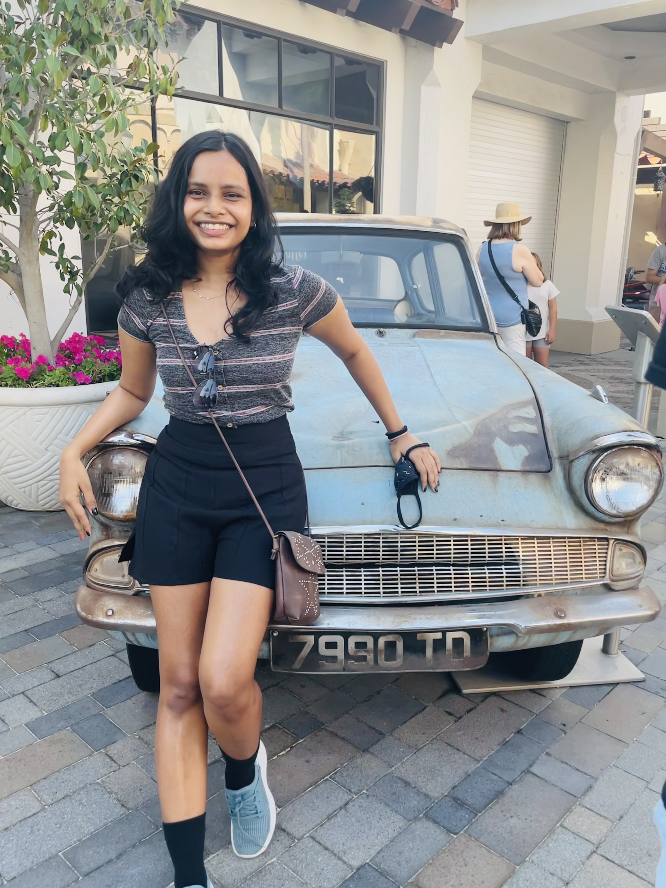

## LAVANYA VERMA
# About

	I'm a Computer Science, Mathematics and Machine learning enthusiast, working towards a _BS in Computer Science_ at UC San Diego, with an expected graduation date of June 2023.
	 I'm currently doing my research under [Prof Niema Moshiri](https://niema.net/) to build Scalable tools for studying viral evolution. Our research is geared upon inferring properties of a real epidemic using only viral sequences learned from the various dependencies of virus transmissions and the patient's genomic sequences. In my free time, you can find me painting my heart out or **try** hiking.
				    > "try"
	  I have also been part of a Teaching and Mentoring program for middle school and budding high school kids for the past 4 years. We have been working to increase Diversity and engagement of underepresented students in STEM fields.
	 I have also worked with IIT Bombay! Click [here](./resume.pdf) to see my resume
```
print("Hello World")
```
 My progress on Lab 1
-[x] Part 1
- [x] Part 2
- [ ] Part 3

# ***Research & Teaching***
1. **Software Engineer at ServiceNow**
   * _June 2021 - Present_
   
    * ServiceNow
      - Interfaced between the Enterprise platform (Discovery Mid servers) and the user for the new features of Mutual Authentication epic.
      - Worked with certificate management utility keytool, keystores and SSL certificates 
      - Built a testing framework by creating scripts to run probes and automating tests in Java.
      - Practiced industry best practices such as: conducting code reviews and participating in distributed development.  

2. **Web Development Intern @ NIC, Govt. of Chhattisgarh, India**
   * _Summer 2018 and 2019_ 
     - Developed a grievance redressal website for the villagers to replace the hefty manual process.
     - Researched and analyzed the population and designed a customized website
     - Online platform switchover helped 28,000 people including saving the daily wages of laborers.
     
3.  * _May 2017 - July 2017 9_ 
     - Researched and worked on IOT: Point Care Devices i.e.
cloud connected Medical Devices
     - Created dynamic maps that responded to real-time user-generated data using the Google Geocoding and Maps APIs in Javascript.
     - Key member in the improvements in design feature inputs in this project of cloud based medical devices.
You can look at my **Occupancy Level Tracker App** [here](https://github.com/FiendFyre5/Occupancy_Level_Tracker).

To go to the top [Click Here](#about)

Do you wanna go back to my about section on github? [Click Here](https://github.com/FiendFyre5/cse110Page/blob/add-gitignore/index.md#about)

A relative link to access the readme file for this assignment is [Link to the README](README.md)

*Disclaimer: This small project was built as a part of my cse 110 lab assignment :)*

